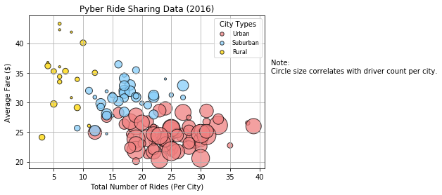
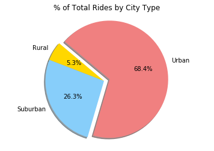
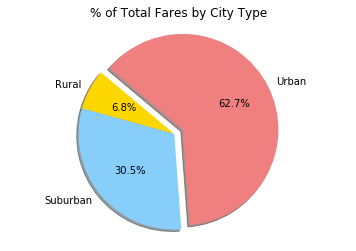
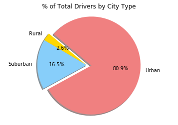
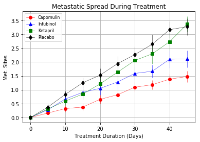
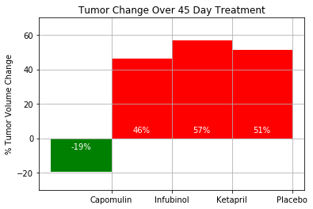
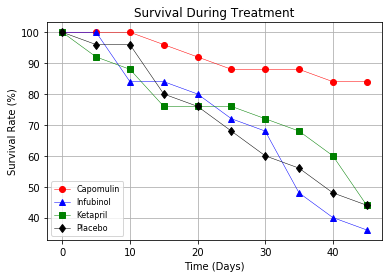
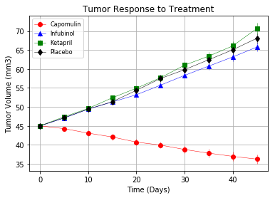

# Matplotlib Practice

### Pyber  

Analysis performed on a sample ride-sharing data set using Python and pandas, and visualizations created using matplotlib.  

Bubble Plot showing the relationship between four key variables:  
  * Average Fare ($) Per City  
  * Total Number of Rides Per City  
  * Total Number of Drivers Per City  
  * City Type (Urban, Suburban, Rural)  

  

Percent of Total Rides by City Type  

  

Percent of Total Fares by City Type  

  

Percent of Total Drivers by City Type  

  

---

### Pymaceuticals  

Analysis performed on a sample pharmaceutical data set using Python and pandas, and visualizations created using matplotlib.  

Number of metastatic sites over time for each treatment  

  

Total % tumor volume change for each drug  

  

Number of mice still alive through the course of treatment  

  

Tumor volume changes over time for each treatment  

